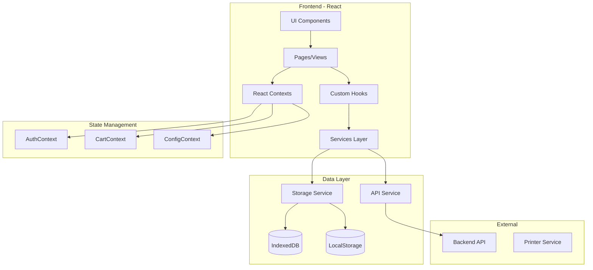

# Design Document: Sistema de Facturación Electrónica

## Overview

Sistema de facturación electrónica desarrollado en React sobre la plantilla Gradient Able. Implementa arquitectura modular con separación clara entre UI, lógica de negocio y persistencia de datos. Utiliza React Context para estado global, React Router para navegación, y localStorage/IndexedDB para persistencia local con capacidad de sincronización con backend.

## Architecture



### Estructura de Carpetas

```
src/
├── components/
│   ├── common/          # Componentes reutilizables
│   ├── forms/           # Formularios
│   ├── tables/          # Tablas y listados
│   └── charts/          # Gráficos
├── contexts/
│   ├── AuthContext.jsx
│   ├── CartContext.jsx
│   └── ConfigContext.jsx
├── hooks/
│   ├── useAuth.js
│   ├── useProducts.js
│   ├── useCart.js
│   ├── useInventory.js
│   └── useSales.js
├── services/
│   ├── api/
│   ├── storage/
│   └── print/
├── models/
│   ├── User.js
│   ├── Product.js
│   ├── Category.js
│   ├── Sale.js
│   └── Invoice.js
├── utils/
│   ├── validators.js
│   ├── formatters.js
│   ├── calculations.js
│   └── serializers.js
└── views/
    ├── auth/
    ├── dashboard/
    ├── users/
    ├── products/
    ├── categories/
    ├── inventory/
    ├── pos/
    ├── sales/
    └── reports/
```

## Components and Interfaces

### AuthContext Interface

```javascript
interface AuthContextValue {
  user: User | null;
  isAuthenticated: boolean;
  login: (email: string, password: string) => Promise<AuthResult>;
  logout: () => void;
  hasPermission: (permission: string) => boolean;
}

interface User {
  id: string;
  name: string;
  email: string;
  role: 'admin' | 'vendedor' | 'cajero';
  isActive: boolean;
  createdAt: Date;
  updatedAt: Date;
}

interface AuthResult {
  success: boolean;
  token?: string;
  user?: User;
  error?: string;
}
```

### CartContext Interface

```javascript
interface CartContextValue {
  items: CartItem[];
  subtotal: number;
  tax: number;
  total: number;
  addItem: (product: Product, quantity: number) => void;
  updateQuantity: (productId: string, quantity: number) => void;
  removeItem: (productId: string) => void;
  clearCart: () => void;
  checkout: (paymentMethod: string, clientData?: Client) => Promise<Sale>;
}

interface CartItem {
  product: Product;
  quantity: number;
  subtotal: number;
}
```

### Product Service Interface

```javascript
interface ProductService {
  create: (product: ProductInput) => Promise<Product>;
  update: (id: string, data: Partial<Product>) => Promise<Product>;
  delete: (id: string) => Promise<void>;
  getById: (id: string) => Promise<Product | null>;
  search: (filters: ProductFilters) => Promise<PaginatedResult<Product>>;
  getByBarcode: (barcode: string) => Promise<Product | null>;
}

interface ProductFilters {
  query?: string;
  categoryId?: string;
  isActive?: boolean;
  page?: number;
  limit?: number;
}
```

### Inventory Service Interface

```javascript
interface InventoryService {
  addStock: (productId: string, quantity: number, reason: string) => Promise<InventoryMovement>;
  removeStock: (productId: string, quantity: number, reason: string) => Promise<InventoryMovement>;
  getStock: (productId: string) => Promise<number>;
  getMovements: (filters: MovementFilters) => Promise<InventoryMovement[]>;
  getLowStockProducts: () => Promise<Product[]>;
}

interface InventoryMovement {
  id: string;
  productId: string;
  type: 'entrada' | 'salida' | 'ajuste';
  quantity: number;
  reason: string;
  userId: string;
  createdAt: Date;
}
```

### Sales Service Interface

```javascript
interface SalesService {
  create: (saleData: SaleInput) => Promise<Sale>;
  getById: (id: string) => Promise<Sale | null>;
  search: (filters: SaleFilters) => Promise<PaginatedResult<Sale>>;
  cancel: (id: string, reason: string) => Promise<Sale>;
  generateInvoice: (saleId: string, type: 'boleta' | 'factura') => Promise<Invoice>;
}

interface Sale {
  id: string;
  number: string;
  items: SaleItem[];
  subtotal: number;
  taxRate: number;
  tax: number;
  total: number;
  paymentMethod: string;
  client?: Client;
  userId: string;
  status: 'completada' | 'anulada';
  createdAt: Date;
}
```

### Print Service Interface

```javascript
interface PrintService {
  printInvoice: (invoice: Invoice, format: PrintFormat) => Promise<void>;
  generatePDF: (invoice: Invoice) => Promise<Blob>;
  getPreview: (invoice: Invoice, format: PrintFormat) => string;
}

interface PrintFormat {
  type: 'thermal' | 'a4';
  width?: '58mm' | '80mm';
  showLogo: boolean;
  footerText?: string;
}
```

## Data Models

### User Model

```javascript
const UserSchema = {
  id: 'string (UUID)',
  name: 'string (required, min: 2, max: 100)',
  email: 'string (required, email format, unique)',
  passwordHash: 'string (bcrypt hash)',
  role: 'enum: admin | vendedor | cajero',
  isActive: 'boolean (default: true)',
  createdAt: 'Date',
  updatedAt: 'Date'
};
```

### Product Model

```javascript
const ProductSchema = {
  id: 'string (UUID)',
  code: 'string (required, unique)',
  barcode: 'string (optional, unique)',
  name: 'string (required, min: 2, max: 200)',
  description: 'string (optional)',
  categoryId: 'string (required, FK to Category)',
  price: 'number (required, min: 0)',
  cost: 'number (optional, min: 0)',
  unit: 'string (required: unidad, kg, litro, etc)',
  stock: 'number (default: 0)',
  minStock: 'number (default: 0)',
  imageUrl: 'string (optional)',
  isActive: 'boolean (default: true)',
  createdAt: 'Date',
  updatedAt: 'Date'
};
```

### Category Model

```javascript
const CategorySchema = {
  id: 'string (UUID)',
  name: 'string (required, min: 2, max: 100)',
  description: 'string (optional)',
  parentId: 'string (optional, FK to Category)',
  isActive: 'boolean (default: true)',
  createdAt: 'Date',
  updatedAt: 'Date'
};
```

### Sale Model

```javascript
const SaleSchema = {
  id: 'string (UUID)',
  number: 'string (correlative, unique)',
  items: 'array of SaleItem',
  subtotal: 'number',
  taxRate: 'number (default: 0.18)',
  tax: 'number',
  total: 'number',
  paymentMethod: 'string (efectivo, tarjeta, transferencia)',
  clientId: 'string (optional, FK to Client)',
  userId: 'string (required, FK to User)',
  status: 'enum: completada | anulada',
  cancelReason: 'string (optional)',
  createdAt: 'Date'
};

const SaleItemSchema = {
  productId: 'string',
  productName: 'string',
  quantity: 'number',
  unitPrice: 'number',
  subtotal: 'number'
};
```

### Invoice Model

```javascript
const InvoiceSchema = {
  id: 'string (UUID)',
  saleId: 'string (FK to Sale)',
  type: 'enum: boleta | factura',
  series: 'string (B001, F001)',
  number: 'string (correlative)',
  issuerData: 'object (company info)',
  clientData: 'object (optional for boleta)',
  items: 'array of InvoiceItem',
  subtotal: 'number',
  tax: 'number',
  total: 'number',
  createdAt: 'Date'
};
```

## Correctness Properties

*A property is a characteristic or behavior that should hold true across all valid executions of a system-essentially, a formal statement about what the system should do. Properties serve as the bridge between human-readable specifications and machine-verifiable correctness guarantees.*

### Property 1: User Creation Integrity
*For any* valid user input data, creating a user should result in a stored user with all required fields populated and password properly hashed (not stored in plain text).
**Validates: Requirements 1.1**

### Property 2: Authentication Consistency
*For any* user with valid credentials, authenticating with those credentials should always succeed and return a valid session token; authenticating with invalid credentials should always fail.
**Validates: Requirements 1.2, 1.3**

### Property 3: Role-Based Access Control
*For any* authenticated user and protected action, the system should allow the action if and only if the user's role has the required permission.
**Validates: Requirements 1.6**

### Property 4: Category Hierarchy Integrity
*For any* category tree, querying categories should return a valid hierarchical structure where each category's product count equals the actual number of products in that category.
**Validates: Requirements 2.5**

### Property 5: Category Deletion Safety
*For any* category with associated products, attempting to delete it should fail; for any category without products, deletion should succeed and remove the category.
**Validates: Requirements 2.3, 2.4**

### Property 6: Product Serialization Round-Trip
*For any* valid product object, serializing to JSON and then deserializing should produce an equivalent product with all attributes preserved.
**Validates: Requirements 3.5, 3.6**

### Property 7: Product Search Consistency
*For any* set of products and search filters, the returned results should contain only products matching all specified filter criteria.
**Validates: Requirements 3.4**

### Property 8: Inventory Balance Invariant
*For any* product, the current stock should equal the initial stock plus all inventory entries minus all inventory exits (sales and adjustments).
**Validates: Requirements 4.1, 4.2**

### Property 9: Stock Validation
*For any* sale attempt where requested quantity exceeds available stock, the operation should be rejected and inventory should remain unchanged.
**Validates: Requirements 4.5**

### Property 10: Cart Calculation Accuracy
*For any* cart with items, the total should equal the sum of all item subtotals plus calculated tax, and each item subtotal should equal quantity times unit price.
**Validates: Requirements 5.3, 5.4, 5.5**

### Property 11: Sale Transaction Integrity
*For any* completed sale, the sale record should contain all items with correct prices, and inventory should be decremented by exactly the quantities sold.
**Validates: Requirements 6.1, 4.2**

### Property 12: Invoice Serialization Round-Trip
*For any* valid invoice object, serializing for storage and then deserializing should produce an equivalent invoice with all fields preserved.
**Validates: Requirements 6.4, 6.5**

### Property 13: Invoice Tax Calculation
*For any* generated invoice, the tax amount should equal the subtotal multiplied by the configured tax rate, and total should equal subtotal plus tax.
**Validates: Requirements 6.2**

### Property 14: Sale Cancellation Reversal
*For any* cancelled sale, the inventory should be restored by exactly the quantities that were originally sold.
**Validates: Requirements 7.3**

### Property 15: Sales Filter Accuracy
*For any* sales query with date range filter, all returned sales should have creation dates within the specified range.
**Validates: Requirements 7.1, 8.3**

### Property 16: Metrics Calculation Accuracy
*For any* set of sales in a period, the calculated total should equal the sum of all individual sale totals, and averages should be mathematically correct.
**Validates: Requirements 8.5**

### Property 17: Report Data Consistency
*For any* generated sales report, the totals should match the sum of all included transactions, and tax breakdown should be accurate.
**Validates: Requirements 9.1**

### Property 18: Print Format Compliance
*For any* thermal print request with specified width (58mm or 80mm), the generated output should be formatted to fit within that width constraint.
**Validates: Requirements 10.3**

## Error Handling

### Validation Errors
- Input validation using Yup schemas
- Display inline error messages on forms
- Prevent submission until all validations pass

### API Errors
- Centralized error handling in API service
- Toast notifications for user feedback
- Automatic retry for transient failures
- Offline queue for operations when disconnected

### Business Logic Errors
- Stock insufficient: Block sale, show available quantity
- Duplicate entries: Prevent creation, show existing record
- Permission denied: Redirect to appropriate page, show message

### System Errors
- Global error boundary for React crashes
- Logging to console/external service
- User-friendly error pages
- Recovery options where possible

## Testing Strategy

### Unit Testing Framework
- **Framework**: Vitest (compatible with Vite)
- **Assertion Library**: Vitest built-in assertions
- **Mocking**: Vitest mocking capabilities

### Property-Based Testing Framework
- **Library**: fast-check
- **Minimum iterations**: 100 per property test
- **Tag format**: `**Feature: sistema-facturacion, Property {number}: {property_text}**`

### Test Categories

#### Unit Tests
- Model validation functions
- Utility functions (formatters, calculators)
- Individual component rendering
- Hook behavior in isolation

#### Property-Based Tests
Each correctness property will have a corresponding property-based test that:
1. Generates random valid inputs using fast-check arbitraries
2. Executes the operation under test
3. Verifies the property holds for all generated inputs
4. Runs minimum 100 iterations

#### Integration Tests
- Context providers with child components
- Service layer with storage
- Multi-step workflows (cart → checkout → invoice)

### Test File Organization
```
src/
├── models/
│   ├── Product.js
│   └── Product.test.js
├── services/
│   ├── salesService.js
│   └── salesService.test.js
├── utils/
│   ├── calculations.js
│   └── calculations.test.js
└── __tests__/
    └── properties/
        ├── cart.properties.test.js
        ├── inventory.properties.test.js
        └── sales.properties.test.js
```
